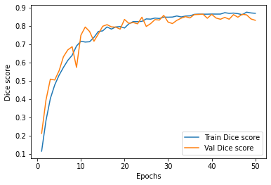

# Medical-Segmentation
Using the [medicaltorch](https://github.com/perone/medicaltorch) library to perform semantic segmentation on [Medical Decathlon](http://medicaldecathlon.com/) datasets.

Used a U-Net with the Dice coefficient as the loss function, the Adam optimizer and a learning rate scheduler.

Results on the Heart dataset:

Sample prediction on a 2D slice post training on the Heart dataset:

